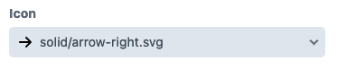
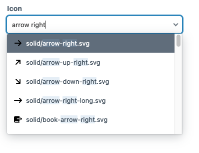
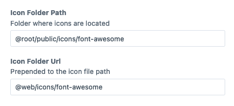

# Icon Picker plugin for Craft CMS

1. Lists icons from a provided folder
2. Saves icon path / filename relative to the `Icon Folder Path` field config




## Installation

```shell
composer require newism/craft-icon-picker -w && php craft plugin/install icon-picker
```

## Configuration

Each field has independent configuration.

* `Icon Folder Path`: Path to the icon folder. eg: `@root/public/icons`
* `Icon Folder Url`: Public URL for icons. eg: `@web/icons`

Note: Icons must be accessible from a public URL



## Usage

Use the `svg()` method combined with the saved field value to output the contents of the `.svg` file.

```twig
{{ svg("@root/public/icons/#{entry.fieldHandle}" }}
```

## TODO

* Write docs
* Release it
